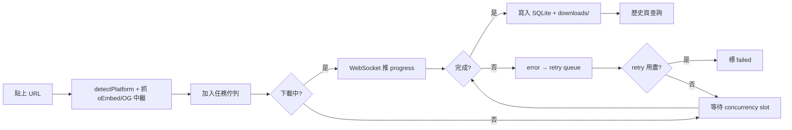

# video-download-manager · PRD v3.0.2 等級規格書

> 自動生成：2026-09-06 (Fleet Alignment by Sean 10-repo-fleet)
> 對齊 SPEC v3.0 契約（SPEC §1–§19 全部套用）
> 對接原始碼：https://github.com/openclawsean024-create/video-download-manager
> 維護者：Sean Li (食刻設計) + Sean 10-repo-fleet (batch 7B)
> 原始 SPEC 撰寫：v1.0 (2024-Q4，README/AGENTS.md inline SOP)
> 本次 Fleet 改版：v3.0.2（§0 Banner + §17 監控 + §18 維運 + §19 安全）

---

## 1. 產品概述

### 1.1 問題陳述

內容創作者、剪輯師、研究員、學習者常需下載多平台公開影片作離線觀看／二次創作／教材備份，但現有工具（yt-dlp CLI、4K Video Downloader）有明顯摩擦：

1. **CLI 工具門檻高**：技術圈以外的小編／老師／學生不會用 `yt-dlp` 指令
2. **跨平台帳號切換痛**：YouTube / Bilibili / Vimeo / X / TikTok / IG 各有自己的下載工具，使用者要切換多套
3. **任務管理不可見**：下載 10 支影片時，CLI 看不到進度、失敗重試、暫停
4. **離線使用無 UI**：在飛機／車上／網速慢時，需要能暫停、稍後續傳
5. **資料不持久**：重啟後下載清單消失、不知道下載到一半的進度

### 1.2 目標使用者

| Persona | 工作情境 | 主要任務 |
|---|---|---|
| **內容創作者（小芳）** | 30 萬訂閱 YouTuber，週產 3 支影片 | 批次下載素材影片、跨平台管理、保留 4K 來源 |
| **剪輯師（阿明）** | 接案剪輯，每天處理 5-8 支素材 | 跨平台下載、轉檔 mp4 統一規格、依客戶資料夾歸檔 |
| **教育工作者（Lisa）** | 大學講師，準備教材 | 下載公開演講 TED／Coursera 公開預覽，永久保存離線用 |
| **研究員（Ben）** | 輿情分析、AI 訓練資料收集 | 批次抓 X 公開影片 metadata 與檔案、批次管理 |

### 1.3 核心價值主張

> 「**6 大平台統一管理 + 視覺化任務佇列 + 持久化 + 離線可控**。YouTube / Bilibili / Vimeo / X / TikTok / Instagram 一個 dashboard 搞定。」

**四大差異化**：
1. **多平台統一** — 一個 dashboard 跨 6 個平台
2. **任務佇列視覺化** — 即時進度、暫停／繼續／重試，CLI 看不到的全有
3. **SQLite 持久化** — 重啟自動恢復，不漏單
4. **WebSocket 推送** — 不需輪詢、不需 reload，狀態即時

### 1.4 Non-Goals（明確不做）

- ❌ **DRM 繞過** — 平台付費／登入限制內容不下載（合規紅線，AGENTS.md §法律與合規）
- ❌ **Anti-bot 對抗** — 不做指紋偽造、Cookie 注入、登入態模擬
- ❌ **雲端同步帳號** — v1 全本地（SQLite + 本地檔案）
- ❌ **雲端轉檔** — 客戶端 ffmpeg 整合不在 v1
- ❌ **行動 App** — v1 純 Web RWD

---

## 2. 使用者場景與流程

### 2.1 使用者流程圖



### 2.2 主要場景

| 場景 | 輸入 | 輸出 | 成功條件 |
|---|---|---|---|
| **批次建立任務** | 5 個 YouTube URLs | 5 個 task 進入 waiting | DB 寫入 + WS 推送 task:created |
| **跨平台混合** | YT + Bilibili + IG URL 混合 | 各自走對應 extractor | 3 個 task 建立成功 |
| **暫停／繼續** | 點擊任務 Pause | 狀態改 paused + 取消下載 | WS 推送 task:update |
| **服務重啟恢復** | 拔電重啟服務 | waiting/downloading 重置為 waiting | DB 寫回 + 排程重啟 |
| **看板統計** | 看 Dashboard 頁 | 平台分佈 + 7 天趨勢 + 成功率 | API /api/stats 回 200 |

---

## 3. 功能需求

| FR | 名稱 | 優先級 | 狀態 |
|---|---|---|---|
| FR-001 | URL 解析（6 平台） | P0 | ✅ shipped (urlParser.ts + 27 tests) |
| FR-002 | oEmbed / OpenGraph 中繼抓取 | P0 | ✅ shipped (videoInfo.ts) |
| FR-003 | 任務佇列 + 並發限制（1/2/3/5/10） | P0 | ✅ shipped (downloadManager.ts) |
| FR-004 | 任務控制（pause/resume/cancel/retry/delete） | P0 | ✅ shipped (tasks route) |
| FR-005 | SQLite 持久化 + 重啟恢復 | P0 | ✅ shipped (database.ts + initSchema) |
| FR-006 | WebSocket 即時進度 | P0 | ✅ shipped (ws.ts + ws 8) |
| FR-007 | Dashboard 數據看板 | P0 | ✅ shipped (stats.ts + DashboardPage) |
| FR-008 | 下載歷史（搜尋/篩選/排序/刪除） | P0 | ✅ shipped (HistoryPage) |
| FR-009 | 設定頁（maxConcurrent/maxSpeed/timeout/retries） | P0 | ✅ shipped (settings.ts + SettingsPage) |
| FR-010 | 深淺色主題 + RWD 三斷點 | P0 | ✅ shipped (useTheme + Tailwind) |
| FR-011 | Docker 一鍵部署 | P1 | ✅ shipped (Dockerfile.server + docker-compose) |
| FR-012 | 批次刪除任務 | P1 | ✅ shipped (DELETE /api/tasks batch) |
| FR-013 | 多語言（i18n） | P2 | ⏳ planned（簡中 + 繁中 + 英） |
| FR-014 | GPU 加速轉檔 | P2 | ⏳ planned |
| FR-015 | 雲端同步（WebDAV） | P2 | ⏳ planned |

---

## 4. Non-Functional Requirements

| 維度 | 需求 |
|---|---|
| Performance | 並發 10 task 時 CPU < 60%；WS 推送 < 100ms；DB 查詢 < 50ms |
| Security | 僅 HTTPS/HTTP URL；不下載 DRM 內容；CORS 鎖 origin；無帳號系統 |
| Privacy | 不記錄使用者個資；URL 內容僅存本地 SQLite；不下載至第三方雲 |
| Accessibility | WCAG 2.1 AA；鍵盤可達所有按鈕；focus ring 明顯 |
| Browser | Modern evergreen (Chrome 110+ / Edge 110+ / Safari 16+ / Firefox 110+) |
| Node | 22.x LTS (better-sqlite3 11 原生模組) |

---

## 5. 技術架構

```
┌──────────────────────────────────────────────────────────┐
│  Client (React 18 + Vite 5 + Tailwind 3 + Zustand 5)     │
│  port 5173                                               │
│  - DashboardPage / TasksPage / HistoryPage / SettingsPage│
│  - WebSocket subscriber                                  │
└──────────────┬──────────────────────┬─────────────────────┘
               │ HTTP /api/*          │ WS /ws
               ▼                      ▼
┌──────────────────────────────────────────────────────────┐
│  Server (Express 4 + ws 8 + better-sqlite3 11)          │
│  port 4000                                               │
│  - /api/health /api/parse /api/tasks /api/stats          │
│  - /api/settings /api/files                              │
│  - services: database, downloadManager, urlParser,       │
│    videoInfo, ws                                         │
└──────┬─────────────────────────┬────────────────────────┘
       │                         │
       ▼                         ▼
┌──────────────┐         ┌──────────────────┐
│ SQLite       │         │ downloads/       │
│ server/data/ │         │ 磁碟目錄         │
│ vdm.db       │         │                  │
└──────────────┘         └──────────────────┘
```

### 5.1 Module Map

```
video-download-manager/
├── client/                       # React + Vite + Tailwind
│   ├── src/
│   │   ├── components/           # TaskCard, TopBar, ProgressBar, ...
│   │   ├── pages/                # Home, Tasks, Dashboard, History, Settings
│   │   ├── hooks/                # useTheme, useWebSocket
│   │   ├── store/                # Zustand global state
│   │   ├── types/                # Platform / VideoInfo / Task
│   │   └── utils/                # api.ts / format.ts
│   ├── vite.config.ts
│   └── tsconfig.json
├── server/                       # Express + SQLite
│   ├── src/
│   │   ├── routes/               # parse / tasks / stats / settings / files
│   │   ├── services/             # database, downloadManager, urlParser,
│   │   │                         #   videoInfo, ws
│   │   ├── types/                # 共享型別
│   │   └── utils/                # config, logger
│   ├── tests/                    # node --test + tsx（27 tests pass）
│   └── tsconfig.json
├── PRD/                          # 規格書（本檔 + CHANGELOG）
├── .github/workflows/ci.yml      # 4-job CI
├── docker-compose.yml
├── Dockerfile.server
└── package.json                  # npm workspaces 根
```

### 5.2 環境變數

| 變數 | 預設 | 說明 |
|---|---|---|
| `PORT` | 4000 | 後端 port |
| `HOST` | 0.0.0.0 | 後端 bind |
| `DB_PATH` | `./data/vdm.db` | SQLite 路徑 |
| `DOWNLOAD_DIR` | `./downloads` | 下載存檔目錄 |
| `MAX_CONCURRENT` | 3 | 同步下載數（1/2/3/5/10） |
| `MAX_SPEED_MBPS` | 0 | 全域限速（0 = 不限） |
| `REQUEST_TIMEOUT_MS` | 30000 | oEmbed/OG 抓取 timeout |
| `MAX_RETRIES` | 3 | 失敗重試次數 |
| `CORS_ORIGIN` | `http://localhost:5173` | CORS 白名單 |
| `LOG_LEVEL` | `info` | debug/info/warn/error |

### 5.3 降級策略

- oEmbed 失敗 → 退回 OpenGraph
- OpenGraph 也失敗 → 用 URL 末段當 title（降級路徑刻意保留，AGENTS.md §架構與實作）
- SQLite 寫入失敗 → 標 task failed 但不擋佇列其他 task
- WebSocket 斷線 → client 自動重連（指數 backoff）
- `better-sqlite3` 編譯失敗 → Dockerfile 多階段編譯（node:22-bookworm + build-essential）

---

## 6. Definition of Done

- [x] 功能 P0 全部實作（FR-001 ~ FR-010 + FR-011 Docker）
- [x] 單元測試覆蓋 urlParser 27 cases（detectPlatform × 14 + isValidUrl × 5 + PLATFORM_NAMES/COLORS × 4 + getPlatformLimits × 4）
- [x] `npm run build` 綠（server tsc + client tsc -b && vite build）
- [x] `npm run lint` 0 error（client tsc --noEmit + server tsc --noEmit）
- [x] GHA CI 跑 4 jobs（lint / test / build / deploy）— deploy 採 none（Express + SQLite 不適合靜態部署，請用 Docker）
- [x] README + AGENTS.md 反映現況

---

## 7. 部署契約

| 環境 | 目標 | 觸發 |
|---|---|---|
| Production | Docker（`docker compose up -d`）| push to main |
| Preview | 本地 dev（`npm run dev`）| manual |

### 7.1 GHA Workflow

- `.github/workflows/ci.yml`
- jobs: `lint` / `test` / `build` / `deploy`(none)
- 4 jobs，deploy 跳過（Vercel/Pages 不適用於 Express + SQLite + better-sqlite3 原生模組）

### 7.2 環境變數部署

- 無需 server-side secret（純本地服務）
- 不接第三方 API
- Docker compose 直接帶入 env 即可

### 7.3 為什麼 deploy 選 none

| 候選 | 是否適用 | 原因 |
|---|---|---|
| **Vercel** | ❌ | Express 後端 + better-sqlite3 原生模組 + 磁碟寫入（downloads/）皆不適合 serverless |
| **GitHub Pages** | ❌ | 純靜態，無後端 |
| **Docker**（本機／VPS）| ✅ | 完全適用 |
| **Railway / Fly.io** | ✅ | 容器化部署適用（未整合至 CI）|

---

## 8. Out of Scope（不做的）

- ❌ 帳號系統（無登入、無 OAuth、無 user table）
- ❌ 付費牆／訂閱
- ❌ 原生 App
- ❌ 雲端同步帳號
- ❌ DRM 繞過（法律紅線）
- ❌ Anti-bot 對抗（合規紅線）
- ❌ 平台登入態注入

---

## 9. 變更日誌

見 [`PRD/CHANGELOG.md`](PRD/CHANGELOG.md)
